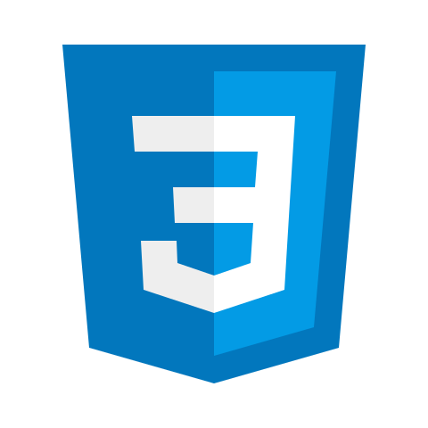
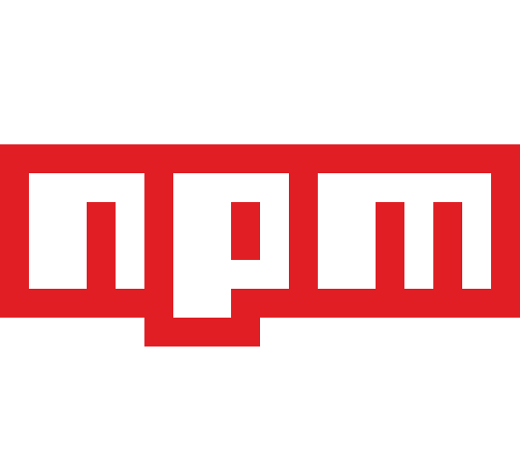

 
<h1 align="center">🌎 @SebasDeveloper 🚀</h1>

I am passionate about technology and collaborative learning, I have a complete professional profile endorsed by my training as a Systems Engineer and especially by my branch of specialization as a Frontend Developer.

 

  

 
 
  
  
  
  

---

### 📊 Github Stats

    

 

    

 

---

### 🔨 Languages and Tools:

 

 
 

 
 

---

⭐️ From [@SebasDeveloper1](https://github.com/SebasDeveloper1) / 2022
